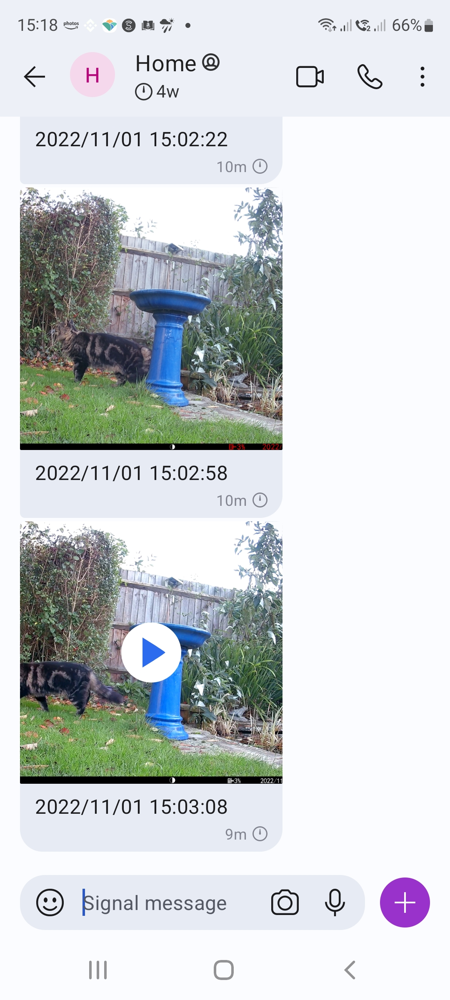

# trailcameradownload

Periodically download pictures and movies from a [wildlife camera](https://www.amazon.co.uk/gp/product/B09Y8V268F)
and send to signal accounts.

I chose an [odroid c4](https://ameridroid.com/products/odroid-c4) with [dual wifi/bluetooth usb adapter](https://thepihut.com/products/combination-wifi-bluetooth-4-0-usb-adapter).

## OS setup

* Setup as per odroid intructions - I used armbian
* see https://github.com/AsamK/signal-cli to install signal-cli
* `sudo apt-get install vim git man-db bluez psmisc wireless-tools libxml2-utils openjdk-17-jdk golang-1.19`
* `git clone https://github.com/plord12/trailcameradownload.git`
* `cd trailcameradownload`
* `make`

## Running

```
$ trailcameradownload-linux-arm64 -signalrecipient +44xxxxxxxx -signaluser +44xxxxxxxx
2022/11/01 10:48:12 Enabling bluetooth
2022/11/01 10:48:12 Scanning bluetooth
2022/11/01 10:48:13 Found bluetooth device: D6:30:35:39:28:30 CPIO3
2022/11/01 10:48:18 Connected to  D6:30:35:39:28:30
2022/11/01 10:48:18 Discovering bluetooth services/characteristics
2022/11/01 10:48:20 Enabled WiFi via bluetooth
2022/11/01 10:48:23 Looking for wifi ssid CEYOMUR-2a78f93b8ad4
2022/11/01 10:48:28 Disconnected from wifi
2022/11/01 10:48:30 Looking for wifi ssid CEYOMUR-2a78f93b8ad4
2022/11/01 10:48:33 Connected to wifi ssid CEYOMUR-2a78f93b8ad4
2022/11/01 10:48:34 Downloading http://192.168.8.120/DCIM/PHOTO/IM_00001.JPG
2022/11/01 10:48:40 signal-cli -u +44xxxxxxxx send +44xxxxxxxx -m 2022/11/01 08:54:38 -a /tmp/image.3954662640.JPG
2022/11/01 10:48:43 Downloading http://192.168.8.120/DCIM/MOVIE/VD_00001.MP4
2022/11/01 10:49:48 signal-cli -u +44xxxxxxxx send +44xxxxxxxx -m 2022/11/01 08:54:50 -a /tmp/image.2097254080.MP4
2022/11/01 10:49:59 Downloading http://192.168.8.120/DCIM/PHOTO/IM_00002.JPG
2022/11/01 10:50:06 signal-cli -u +44xxxxxxxx send +44xxxxxxxx -m 2022/11/01 09:58:12 -a /tmp/image.1607871999.JPG
2022/11/01 10:50:10 Downloading http://192.168.8.120/DCIM/MOVIE/VD_00002.MP4
2022/11/01 10:51:10 signal-cli -u +44xxxxxxxx send +44xxxxxxxx -m 2022/11/01 09:58:22 -a /tmp/image.3369696231.MP4
2022/11/01 10:51:22 Disconnected from wifi
```

