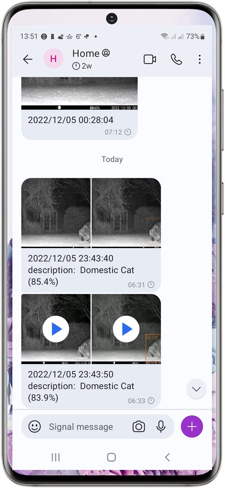

# trailcameradownload

Periodically download pictures and movies from a [wildlife camera](https://www.amazon.co.uk/gp/product/B09Y8V268F), 
attempt to identifiy animals and send to signal accounts.

I chose an [odroid c4](https://ameridroid.com/products/odroid-c4) with [dual wifi/bluetooth usb adapter](https://thepihut.com/products/combination-wifi-bluetooth-4-0-usb-adapter).

## OS setup

* Setup as per odroid intructions - I used armbian
* see https://github.com/AsamK/signal-cli to install signal-cli
* `sudo apt-get install vim git man-db bluez psmisc wireless-tools libxml2-utils openjdk-17-jdk golang-1.19`
* `git clone https://github.com/plord12/trailcameradownload.git`
* `cd trailcameradownload`
* `make`

See https://github.com/plord12/vizy-training for an attempt to train a tensorflow lite model.

## Usage

```
$ ./trailcameradownload-linux-arm64 --help
Usage of ./trailcameradownload-linux-arm64:
  -address string
    	Bluetooth address (default "D6:30:35:.*")
  -characteristic string
    	Bluetooth characteristic UUID (default "0000ffe9-0000-1000-8000-00805f9b34fb")
  -label string
    	path to label file (default "labelmap.txt")
  -limits int
    	limits of items (default 5)
  -model string
    	path to model file (default "detect.tflite")
  -password string
    	WiFi password (default "12345678")
  -savejpg
    	save jpg files to $HOME/photos
  -signalrecipient string
    	Signal messenger recipient - quote for multiple users
  -signaluser string
    	Signal messenger username
  -ssid string
    	WiFi SSID (default "CEYOMUR-.*")
```

## Running

```
$ trailcameradownload-linux-arm64 -signalrecipient "+44xxxxxxxxxx" -signaluser +44xxxxxxxxxx
2022/12/06 06:30:02 Loaded model detect.tflite with labelmap.txt
2022/12/06 06:30:02 Enabling bluetooth
2022/12/06 06:30:02 Scanning bluetooth for D6:30:35:.*
2022/12/06 06:30:13 Found bluetooth device: D6:30:35:39:28:30 HTC-35392830
2022/12/06 06:30:18 Bluetooth connect failed [1 of 10] - failed to connect to bluetooth device - Software caused connection abort
2022/12/06 06:31:07 Connected to  D6:30:35:39:28:30
2022/12/06 06:31:07 Discovering bluetooth services/characteristics
2022/12/06 06:31:09 Enabled WiFi via bluetooth
2022/12/06 06:31:09 Looking for WiFi SSID CEYOMUR-.*
2022/12/06 06:31:09 WiFi connect failed [1 of 10] - SSID not found
2022/12/06 06:31:11 Looking for WiFi SSID CEYOMUR-.*
2022/12/06 06:31:11 WiFi connect failed [2 of 10] - SSID not found
2022/12/06 06:31:13 Looking for WiFi SSID CEYOMUR-.*
2022/12/06 06:31:13 WiFi connect failed [3 of 10] - SSID not found
2022/12/06 06:31:15 Looking for WiFi SSID CEYOMUR-.*
2022/12/06 06:31:15 WiFi connect failed [4 of 10] - SSID not found
2022/12/06 06:31:17 Looking for WiFi SSID CEYOMUR-.*
2022/12/06 06:31:17 WiFi connect failed [5 of 10] - SSID not found
2022/12/06 06:31:19 Looking for WiFi SSID CEYOMUR-.*
2022/12/06 06:31:19 WiFi connect failed [6 of 10] - SSID not found
2022/12/06 06:31:21 Looking for WiFi SSID CEYOMUR-.*
2022/12/06 06:31:21 WiFi connect failed [7 of 10] - SSID not found
2022/12/06 06:31:23 Looking for WiFi SSID CEYOMUR-.*
2022/12/06 06:31:24 Connected to WiFi SSID CEYOMUR-2a78f93b8ad4
2022/12/06 06:31:24 Date set to 2022-12-06
2022/12/06 06:31:24 Time set to 06:31:24
2022/12/06 06:31:25 Battery at 30%
2022/12/06 06:31:28 2 files on camera
2022/12/06 06:31:28 Downloading http://192.168.8.120/DCIM/PHOTO/IM_00001.JPG
2022/12/06 06:31:33 Downloading http://192.168.8.120/DCIM/MOVIE/VD_00001.MP4
2022/12/06 06:31:34 Domestic_Cat (85.4%)
2022/12/06 06:31:41 signal-cli [-u +xxxxxxxxxxxx send +xxxxxxxxxxxx +xxxxxxxxxxxx -m 2022/12/05 23:43:40 description:  Domestic Cat (85.4%) -a /tmp/image.3976206402.JPG /tmp/detected.1110883107.0.JPG]
2022/12/06 06:31:48 Deleted A:\DCIM\PHOTO\IM_00001.JPG
2022/12/06 06:31:49 Finished download
2022/12/06 06:33:33 Domestic_Cat (83.9%)
2022/12/06 06:33:43 signal-cli [-u +xxxxxxxxxxxx send +xxxxxxxxxxxx +xxxxxxxxxxxx -m 2022/12/05 23:43:50 description:  Domestic Cat (83.9%) -a /tmp/image.1047981556.MP4 /tmp/detected.464454339.MP4]
2022/12/06 06:33:52 Deleted A:\DCIM\MOVIE\VD_00001.MP4
2022/12/06 06:33:52 Finished
2022/12/06 06:34:02 Disconnected from WiFi
```

